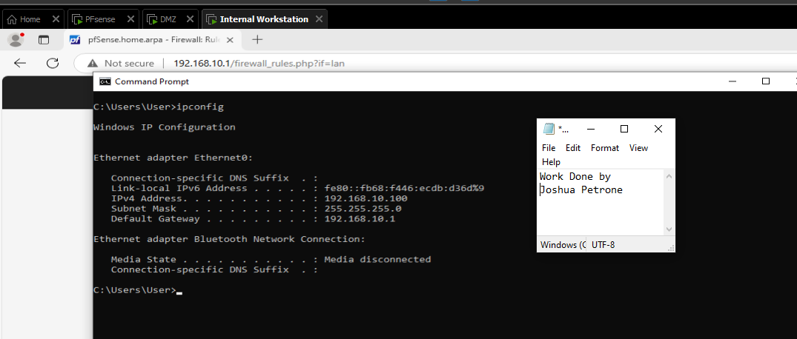
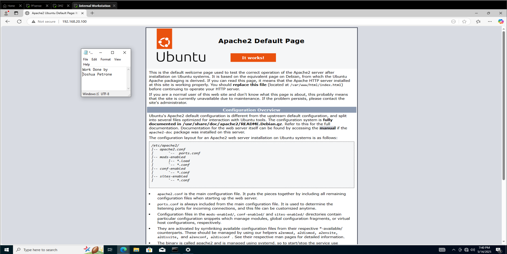

# pfSense DMZ Firewall Project

This project simulates a secure enterprise network environment using **pfSense** and **VMware Workstation**. It demonstrates basic firewall segmentation between a **LAN**, a **DMZ** (Demilitarized Zone), and an **Internet WAN connection**.

---
## 🌐 Network Setup

- **pfSense Firewall**  
  - WAN Interface (Internet/NAT)
  - LAN Interface (Internal Network)
  - DMZ Interface (Web Server Zone)

- **Internal Workstation (Windows 10)**  
  - Connected to LAN
  - Should access Internet and DMZ web server over HTTP

- **Web Server (Ubuntu + Apache2)**  
  - Connected to DMZ
  - Hosts a basic HTTP web server

---

## 🛡️ Firewall Rules Summary
- **LAN to Internet**:
    
    LAN users can browse the web and access the Internet freely.
    
- **LAN to DMZ**:
    
    LAN users can only reach the DMZ web server through **HTTP (port 80)**.
    
    All other types of access (like ping, SSH, or file sharing) are blocked.
    
- DMZ to Internet:
  
  DMZ servers can access the Internet for things like software updates, but only on safe ports like **HTTP/HTTPS**.

- **DMZ to LAN**:

  DMZ servers are **not allowed** to talk to the LAN at all, for security reasons.
  
- **Internet to LAN/DMZ**:

  People from the Internet can't access anything inside the LAN or DMZ, unless specific access is set up.

---

## 📸 Screenshots

### Screenshots for LAN

- IP Configuration of Internal Workstation VM

As you can see the Ipconfig output showcases the IP address in the LAN subnet (e.g. 192.168.10.x) This confirms the correct network configuration for the following VM. 

- Firewall Rules on pfSense for LAN

Firewall rules from LAN permit only TCP connections to port 80 in the DMZ and block ICMP for tighter security

- HTTP Access to DMZ Web Server

Internal VM successfully accessed the Apache web server in the DMZ over HTTP (TCP port 80), verifying firewall rule allows it.

---

### Screenshots for DMZ

- IP Configuration of DMZ VM and View of HTTP Web server

The DMZ VM is assigned to an IP in the correct subnet (e.g. 192.168.20.x) ensuring a proper configuration. As well the Apache Web Server is up and running listening on TCP port 80. Essentially making the DMZ host accessible for HTTP connections

- Firewall rules on pfSense for DMZ

Here is the firewall rules for DMZ in pfSense. Looking at rule 1 I only allow HTTP (port 80) traffic from internal clients to access the DMZ web server. Then with rule 2 denying all other traffic to/from the DMZ, acting as a default deny rule.

This setup is important because it ensures the DMZ access is controlled and the as well prevents movement from DMZ to LAN if an attacker tried to move laterally. 

---

### Screenshots for pfSense VM

- Interface Assignments

pfSense terminal interface showing assigned interfaces and their respective IP addresses for WAN (em0), LAN (em1), and DMZ (em2). This verifies network segmentation was successfully implemented.

---

## 📚 What I Learned

---

## 🔥 Future Improvements
